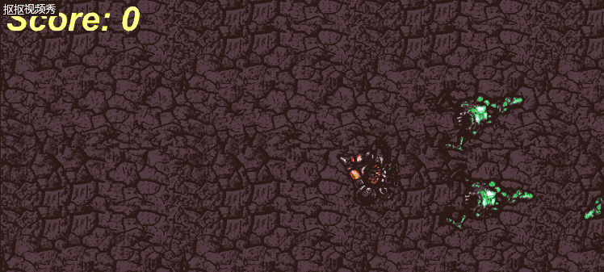

# 制作 HTML5 游戏

这是第一次制作HTML5游戏，也是第一次使用构造2（Construct 2）这款软件。发现即使一个简单的，让玩家看着鼠标，用箭头键移动，用鼠标射击怪物的游戏，也很难制作。体验了下做游戏的感觉。

1.打开Construct 2后会有选择模板的环节，由于只是制作一个简单的游戏，五哦以我们只需选择一个空模板。

2.通过双击布局中的空格以插入新对象。这时我们需要插入5个对象，分别是地砖，玩家，怪物，子弹和爆炸。

3.简单的调整一下视图的大小，接下来就可以开始编辑图层以及给对象加入行为了。添加行为需要用到位于左侧的操作栏，找到Behaviors,打开界面就可以开始添加了。

- 对于玩家

 1）加入8方向操作。

 2）添加Scroll To行为，使屏幕跟随播放器。

 3）让玩家打出子弹，并且调整射出位置到枪口。

 4)让玩家一直面向鼠标的方向。

 - 对于怪兽

 1)随机移动（尽量让怪兽看起来更加智能）。
 2）在碰到屏幕的边缘时，更正方向。
 3）每间隔一段时间自动生成新的怪物。
 4）在接触到玩家时消灭之。

 - 对于子弹

 1）设置子弹的移动速度。
 2）在碰到怪物后消失同时生成爆炸对象。

 编辑上面所说的行为需要用到事件表（Event sheet ）

 

 其次，现在的游戏中玩家只需要1颗子弹便可以击败怪兽，让我们增加些难度，首先编辑对象，将怪物赋予生命值，在事件表中将子弹的命中效果由消灭怪物改为减去1点生命值，在怪兽生命值用尽后被消灭。

 最后，为了让玩家清楚自己的游戏进度，在事件表中加入计数表，使玩家能够看到自己消灭的怪兽的数量。

 现在，让我们试试这个游戏吧！

<<<<<<< HEAD

=======

>>>>>>> 14c633e0e35d22210fe7210f2f795693af60c528
